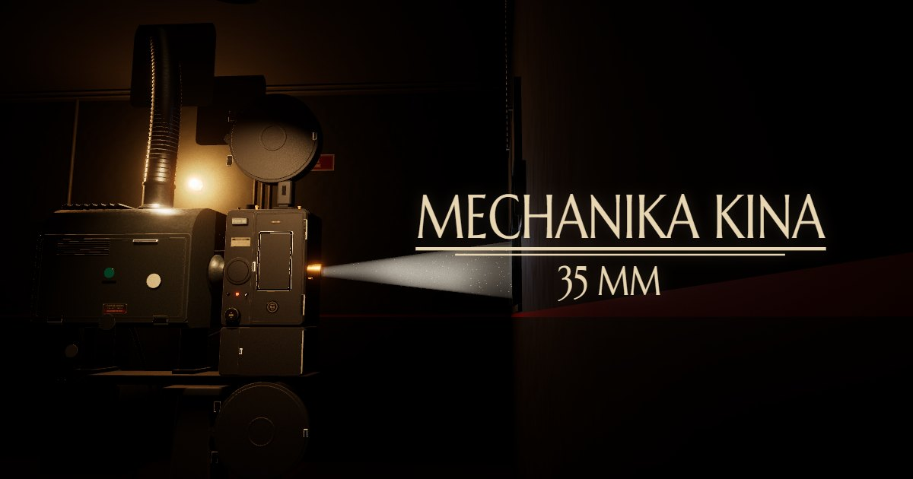

# Mechanika kina — projektor 35 mm

Interaktywna ekspozycja 3D w przeglądarce. Najpierw krótki film o magii kina, potem płynne przejście do kabiny
projekcyjnej, w której stoi działający projektor kinowy 35 mm. Można go uruchomić, zajrzeć do środka i zobaczyć, jak powstaje
ruchomy obraz.

**Zobacz online:** https://apkmason.dev/mechanika-kina/



## Co pokazuje ekspozycja

Projektor jest inspirowany głowicą Simplex X-L (1949/1950) z późniejszą lampą ksenonową. To model dydaktyczny,
nie dokumentacja wymiarowa konkretnego egzemplarza. Cała mechanika wynika z jednego zegara, więc wszystkie części
pracują w prawdziwym takcie:

- **krzyż maltański** przesuwa taśmę o jedną klatkę (4 perforacje, 19 mm) w 90° obrotu krzywki i trzyma ją nieruchomo przez pozostałe 270°;
- **migawka dwułopatkowa** zasłania okienko przez cały przesuw i dodatkowo przerywa nieruchomy obraz, więc na ekranie pojawia się 48 błysków na sekundę;
- **pętle** nad okienkiem i pod nim oddychają w przeciwfazie, łagodząc szarpnięcie ruchu przerywanego;
- **taśma** przechodzi ze szpuli podającej przez rolki zębate, okienko i głowicę dźwiękową do szpuli nawijającej. W okienku obraz jest odwrócony;
- **ekran w sali** za oknem kabiny pokazuje dokładnie tę klatkę, która w danej chwili stoi w okienku.

Sześć trybów zwiedzania:

| Tryb | Co widać |
|---|---|
| I · Praca | cały projektor przy 24 kl./s |
| II · Droga taśmy | otwarte drzwi i strzałki biegnące razem z taśmą |
| III · Droga światła | łuk ksenonowy, lustro eliptyczne, migawka, okienko, obiektyw i wiązka do ekranu |
| IV · Zwolnienie ×1/48 | migawka i krzyż maltański w zwolnionym tempie z diagramem jednego cyklu |
| V · Wnętrze | komora przekładni po zdjęciu pokrywy |
| VI · Rozkład | główne zespoły rozsunięte i opisane |

## Sterowanie

| | |
|---|---|
| przeciągnięcie / jeden palec | obrót wokół projektora |
| kółko / dwa palce | zbliżenie i przesuwanie |
| prawy przycisk lub Shift | przesunięcie |
| 1–6 | tryby |
| Spacja · L · M | silnik · lampa · migawka (wyłączona migawka pokazuje smużenie obrazu) |
| Esc / R | powrót do ujęcia trybu |
| Ekran / Powrót | widok przez okno kabiny na ekran i z powrotem |
| klik w oznaczenie | kamera podjeżdża do elementu |

Najlepiej na komputerze, na pełnym ekranie i z dźwiękiem. Wymagana przeglądarka z obsługą WebGL 2.

## Uruchomienie lokalne

Wymagany Node.js 20.19+ lub 22.12+.

```bash
npm ci
```

```bash
npm run dev
```

Strona będzie dostępna pod adresem http://localhost:5173.

Build produkcyjny i jego podgląd:

```bash
npm run build
```

```bash
npm run preview
```

## Publikacja

Każdy push na gałąź `main` uruchamia workflow `.github/workflows/pages.yml`, który buduje projekt i publikuje go
na GitHub Pages. Ścieżki zasobów są względne, więc strona działa pod adresem podkatalogu repozytorium.

## Technologia

- [three.js](https://threejs.org/) — renderowanie 3D, [postprocessing](https://github.com/pmndrs/postprocessing) — bloom, mapowanie tonów, winieta, ziarno;
- [Vite](https://vite.dev/) — build;
- model projektora i kabiny zbudowany proceduralnie w Blenderze, eksportowany do glTF i skompresowany Meshopt;
- dźwięk syntezowany w Web Audio i zsynchronizowany z pracą krzyża maltańskiego;
- czcionki Marcellus SC, Barlow Condensed, IBM Plex Mono i Cormorant Garamond (SIL Open Font License) przez Fontsource.

```
index.html          punkt wejścia (bilet, intro, interfejs)
src/main.js         ładowanie, renderer, post-processing, tryby
src/intro.js        film intro i przejście do sceny 3D
src/modes.js        tryby, ujęcia kamery i oznaczenia
src/scene/          mechanika, taśma, wiązka, ekran, materiały, kamera
src/ui/             pulpit, oznaczenia, diagram czasowy, podgląd ekranu
public/models/      model (GLB) i układ mechanizmu (layout.json)
public/media/       film intro i atlas klatek taśmy
```
